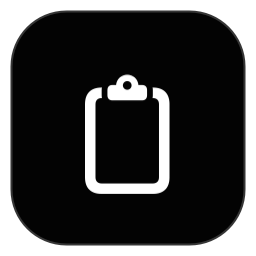

<p align="center">
  
</p>

<h1 align="center">ClipboardHistory</h1>

<p align="center">
  A private, native clipboard manager for the macOS menu bar.
</p>

<p align="center">
  <a href="README_TR.md">Türkçe</a>
</p>

ClipboardHistory keeps clipboard history locally on your Mac. It is written in Swift 6 with SwiftUI and AppKit and has no networking, telemetry, account system, cloud service, or third-party runtime dependency.

## Current status

- Current Community beta: [`v1.0.0-beta.2`](https://github.com/BGirginn/ClipboardHistory/releases/tag/v1.0.0-beta.2) (`1.0.0`, build `10002`)
- Supported platform: Apple silicon (`arm64`) with macOS 14 Sonoma or later
- The source on `main` is public and current
- The signed ZIP, DMG, checksum, SPDX SBOM, and signing evidence are published with the GitHub prerelease
- The Homebrew Cask is published from [`BGirginn/homebrew-tap`](https://github.com/BGirginn/homebrew-tap)
- The Community build is self-signed and is not Apple-notarized

## Install

Install with Homebrew:

```sh
brew tap BGirginn/tap
brew trust BGirginn/tap
brew install --cask clipboardhistory
```

Homebrew 6 requires explicit trust for third-party taps. If `/Applications/ClipboardHistory.app` was installed manually before using the Cask, quit ClipboardHistory and move that existing app bundle out of `/Applications` first. Clipboard history is stored separately under Application Support and is not removed by this migration.

To update or uninstall later:

```sh
brew update
brew upgrade --cask clipboardhistory
brew uninstall --cask clipboardhistory
```

Normal uninstall preserves clipboard history and preferences. `brew uninstall --cask --zap clipboardhistory` also deletes that local user data.

The Community beta is self-signed and not notarized. If macOS blocks the first launch, open Applications in Finder, Control-click ClipboardHistory, choose **Open**, and confirm. The same approval is available under System Settings → Privacy & Security. Do not remove quarantine with `xattr`.

The ZIP and DMG can also be downloaded from the [GitHub Release](https://github.com/BGirginn/ClipboardHistory/releases/tag/v1.0.0-beta.2).

## Features

- Text, URL, email, source-code, rich-text, image, PDF, and file/folder history
- Type/date/source filters, sorting, collections, tags, pinned items, and snippets
- Copy, restore, paste to the active app, Paste As, Quick Look, drag and drop, and bulk actions
- FIFO/LIFO Paste Stack and keyboard-oriented navigation
- System, Light, and Dark appearance options
- Private Mode, temporary recording pause, app exclusions, and Ignore Next Copy toggle
- Left-click the menu-bar icon to open the panel or right-click it to open a menu with Quit
- Optional application lock using Touch ID or the Mac login password
- Local secret detection and temporary handling for sensitive clipboard items
- AES-GCM history encryption with a Keychain-backed key and no plaintext fallback
- Password-protected local archive export/import
- Local Vision OCR, QR recognition, and color analysis
- English and Turkish localization

## Privacy model

ClipboardHistory reads only clipboard changes exposed through `NSPasteboard`. It does not watch the Desktop or other folders and does not send clipboard content over the network.

History is stored locally in SQLite. Encryption keys live in the macOS login Keychain; Keychain failures are handled fail-closed. The optional application lock is a viewing and interaction privacy layer and is disabled by default.

See [Privacy and Threat Model](docs/PRIVACY_AND_THREAT_MODEL.md) and [Known Limitations](docs/KNOWN_LIMITATIONS.md) for the full boundary.

## Build from source

Requirements:

- Apple silicon Mac
- macOS 14 or later
- Xcode with Swift 6 support

Clone the repository and create the local self-signed Community identity. This does not require a paid Apple Developer account:

```sh
git clone https://github.com/BGirginn/ClipboardHistory.git
cd ClipboardHistory
scripts/create-community-signing-identity.sh
scripts/verify-community-signing.sh
```

Build and launch the Community configuration:

```sh
xcodebuild \
  -project ClipboardHistory.xcodeproj \
  -scheme ClipboardHistory \
  -configuration CommunityRelease \
  -destination 'generic/platform=macOS' \
  -derivedDataPath .build/LocalRelease \
  ARCHS=arm64 ONLY_ACTIVE_ARCH=NO \
  CODE_SIGN_STYLE=Manual \
  CODE_SIGN_IDENTITY='ClipboardHistory Community Beta' \
  build

open .build/LocalRelease/Build/Products/CommunityRelease/ClipboardHistory.app
```

The certificate private key remains in the user's login Keychain and must never be committed.

## Usage

ClipboardHistory runs as a menu-bar application and does not appear in the Dock. Click the clipboard icon or press `Command-Shift-V` to open the panel.

Clipboard history and managed assets are stored under:

```text
~/Library/Application Support/ClipboardHistory/
```

Direct paste requests require macOS Accessibility permission. Clipboard capture, panel access, and the global shortcut do not require that permission.

## Development

Compile without signing:

```sh
xcodebuild \
  -project ClipboardHistory.xcodeproj \
  -scheme ClipboardHistory \
  -configuration Debug \
  -destination 'platform=macOS,arch=arm64' \
  CODE_SIGNING_ALLOWED=NO \
  build
```

Project documentation:

- [Architecture](docs/ARCHITECTURE.md)
- [Testing](docs/TESTING.md)
- [Performance](docs/PERFORMANCE.md)
- [Distribution](docs/DISTRIBUTION.md)
- [Security Policy](SECURITY.md)
- [Contributing](CONTRIBUTING.md)

## Distribution

`v1.0.0-beta.2` is distributed as a public GitHub prerelease and through the `BGirginn/homebrew-tap` Cask. The downloadable application is arm64-only, self-signed, and not notarized. Release checksums, the SPDX SBOM, designated requirement, and signing-certificate fingerprint are attached to the release.

## License

ClipboardHistory is available under the [MIT License](LICENSE).
